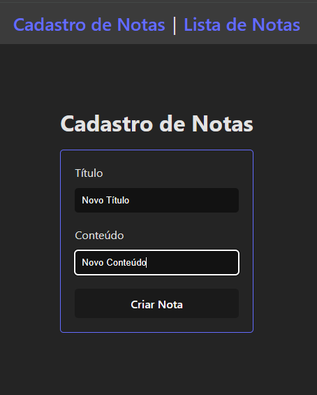

# Gerenciador de Notas - Backend

[Tecnologias](#tecnologias) | [Funcionalidades](#funcionalidades) | [Descrição](#descrição) | [Instalação](#instalação) | [Avisos](#avisos) | [Imagens](#imagens) | [Suporte](#suporte) | [TODO](#todo) | [Lista de bugs](#lista-de-bugs) | [Bugs Resolvidos](#bugs-resolvidos)

## Tecnologias

<ul>
  <li>Node</li>
  <li>Nest.js</li>
</ul>

[Ir para o topo](#gerenciador-de-notas---backend)

## Funcionalidades

- &check; 
<!-- - &check;  -->
<!-- - &check;  -->
<!-- - &check;  -->
<!-- - &check;  -->
<!-- - &check;  -->
<!-- - &check;  -->
- &#x2610; 
<!-- - &#x2610;  -->
<!-- - &#x2610;  -->
<!-- - &#x2610;  -->
<!-- - &#x2610;  -->
<!-- - &#x2610;  -->
<!-- - &#x2610;  -->


[Ir para o topo](#gerenciador-de-notas---backend)

## Descrição


[Ir para o topo](#gerenciador-de-notas---backend)

## Instalação

1. Faça um clone do repositório:
```bash
git clone git@github.com:rushxpush/gerenciador-notas-backend.git
cd gerenciador-notas-backend 
```

2. Monte a imagem e rode:
```bash
docker compose up --build
```

3. Não esqueça de montar a imagem do backend e rodar. Link: [gerenciador-notas-frontend](https://github.com/rushxpush/gerenciador-notas-frontend)

4. Acesse o back em [localhost:3000](http://localhost:3000)

[Ir para o topo](#gerenciador-de-notas---backend)

## Avisos

Futuros avisos

[Ir para o topo](#gerenciador-de-notas---backend)

## Imagens

<!--  -->

## Suporte

Qualquer dúvida mande um email para [rafagarciadev@gmail.com](mailto:rafagarciadev@gmail.com)

[Ir para o topo](#gerenciador-de-notas---backend)

## Todo

- &check; POST /notes
- &check; GET /notes
- &check; Testes unitários NotesController create
- &check; Testes unitários NotesController findAll 
- &check; Testes unitários NotesService create 
- &check; Testes unitários NotesService findAll 
- &#x2610; Validation Pipes
<!-- - &check;  -->
<!-- - &check;  -->
<!-- - &check;  -->
<!-- - &check;  -->
<!-- - &check;  -->
<!-- - &check;  -->
<!-- - &check;  -->
<!-- - &#x2610;  -->
<!-- - &#x2610;  -->
<!-- - &#x2610;  -->
<!-- - &#x2610;  -->
<!-- - &#x2610;  -->
<!-- - &#x2610;  -->
<!-- - &#x2610;  -->

Qualquer dúvida mande um email para [rafagarciadev@gmail.com](mailto:rafagarciadev@gmail.com)

[Ir para o topo](#gerenciador-de-notas---backend)

## Lista de bugs

[Ir para o topo](#gerenciador-de-notas---backend)

## Bugs Resolvidos

[Ir para o topo](#gerenciador-de-notas---backend)